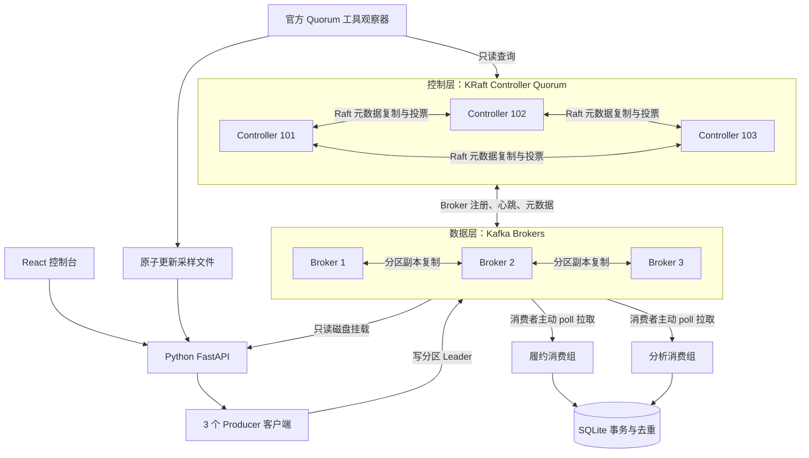
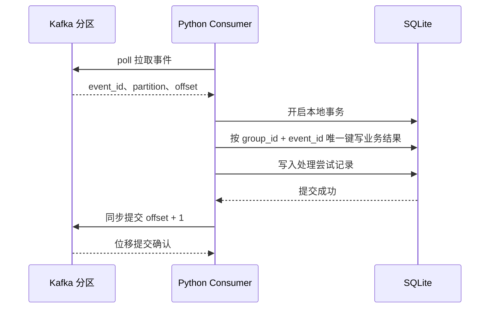

# 架构图与项目实现的对应关系

## 1. 分离控制层与数据层

本项目遵循根目录 `kafka_kraft_arch.png`，使用固定三投票节点的 KRaft Quorum。Controller 仅承担 `controller` 角色，Broker 仅承担 `broker` 角色。静态 Quorum 用于保持本地实验拓扑清晰，不表示 KRaft 只能使用静态成员配置。

图中的业务消息不会经过 Controller 转发。Producer 和 Consumer 从 Broker 获取元数据并访问对应分区；Controller 管理控制面，包括 Broker 状态和分区领导权。

## 2. 全部知识点覆盖表

| 原图知识点 | 真实实现 | 观察 / 实验入口 |
| --- | --- | --- |
| 不需要 ZooKeeper | Compose 中没有 ZooKeeper，Kafka 4.1.2 KRaft | `compose.yaml`、运行服务列表 |
| 3 个 Controller | 独立容器、节点 101 / 102 / 103、独立卷 | 总览控制层 |
| Active / Standby | `kafka-metadata-quorum describe --status` 读取 Leader ID | 停止当前 Active，观察新 Leader 和 Epoch |
| Raft 元数据复制 / 共识 | 官方 `describe --replication` 输出各节点 Log End Offset、Lag | 总览“Raft 元数据复制” |
| 元数据管理 | 创建 Topic、扩展分区、维护 Broker 与副本元数据 | 初始化、扩展、元数据日志解码 |
| Broker 注册与状态变化 | 六节点真实协议通信，Admin API 读取在线 Broker | 停止 / 恢复 Broker，观察列表及活动日志 |
| Broker 心跳 | Kafka Broker 与 Controller 的原生机制 | 故障检测后分区 Leader / ISR 变化；容器日志补充协议细节 |
| 控制面 / 数据面分离 | 不使用 `broker,controller` 混合角色 | `KAFKA_PROCESS_ROLES`，分别故障两类节点 |
| 多个 Producer | 三个真实、不同 `client.id` 的 Python Producer | 工作台 Producer 下拉框 |
| 按分区写消息 | 自动 Key 分区或显式指定分区 | 生产回执中的分区和 Offset |
| 3 个 Broker | 3 个独立 Kafka 进程及数据卷 | 总览 Broker 卡片 |
| Topic A / B | 对应 `orders` / `payments` | 初始分区数 2 / 1 |
| Leader / Follower | 显式三副本初始分配，Admin API 查询实际领导权 | 拓扑中的角色与副本列表 |
| 副本机制与可靠性 | 副本因子 3，min ISR 2，acks all，禁用 unclean election | 单 Broker / 双 Broker 故障实验 |
| 两个 Consumer Group | `lab-fulfillment` / `lab-analytics` | 分别启动成员，独立观察业务计数与位移 |
| 每组多个 Consumer | 每个 Worker 持有独立 Kafka Consumer | 加减成员，观察 Rebalance |
| 按分区拉取消息 | `subscribe` + `poll`、真实分配回调 | Worker 分区标签 |
| 消费组负载均衡 | 同组共享分区，不同组独立订阅 | 第四个成员空闲、扩分区后重新分配 |
| 按顺序追加消息 | Broker 原生日志写入 | 固定分区发送、回执 Offset 和回放 sequence |
| 消息持久化 | 三个 Broker 使用命名卷 | 保留卷重启、历史消息回放 |
| `.log` | 真实 Kafka 日志段 | 文件列表及 `lab.sh dump` |
| `.index` | 真实 Offset 稀疏索引 | 文件列表；与 `.log` 使用相同基准 Offset 文件名 |
| `.timeindex` | 真实时间索引 | 文件列表；详见实验手册 |
| 消息可回放 | 独立 assign 读取，或停止消费组后重置位移 | 工作台只读回放 / 消费组重置 |
| 水平扩展 | 多 Broker 分布式部署、动态增加分区与消费者 | 实验室分区扩展；增加 Broker 的边界见下节 |

## 3. 三种“位置”不要混淆

1. **业务分区 Offset**：例如 `orders/P0` 中的第 15 个位置，只在该分区有意义。
2. **消费组已提交 Offset**：该消费组在某分区下一条要读取的位置。例如处理了 Offset 15 后，提交 16。
3. **Quorum High Watermark**：控制层元数据日志的提交进度，不能拿它当订单消息条数。

`Lag = 分区日志末端 Offset - 消费组已提交 Offset` 是本项目主要观察指标；尚未提交时按 `earliest` 策略估计。保留清理、日志压缩、事务或位移超出保留范围时，Offset 差值不一定等于可见业务消息数量。

Kafka 4.x 的普通 MetadataResponse 中 `controller_id` 不应用于识别这里的独立 Active Controller。本项目使用官方 Quorum 查询的 `LeaderId` 展示控制层领导者。

## 4. 消费处理的故障窗口

如果数据库已提交而位移尚未提交时进程崩溃，同一事件会再次出现。唯一约束使重试变成“重复已跳过”，避免增加第二份业务结果。这不是跨 Kafka 与 SQLite 的分布式原子事务，而是至少一次消费配合业务幂等。

如果 SQLite 写入失败，则不提交消费位移。如果坏消息无法解析或业务字段缺失，Worker 报错停止，后续处理需要修复数据 / 程序或制定补偿策略。生产系统通常还需要带可观测性的重试 / 死信流程。

## 5. 日志与持久化

- Broker 业务日志位于 `/var/lib/kafka/data/orders-N` 和 `/var/lib/kafka/data/payments-N`。
- Controller 元数据位于 `/var/lib/kafka/data/__cluster_metadata-0`。
- 消费组位移使用 Kafka 内部 Topic `__consumer_offsets`，同样具有副本配置。
- 业务 Topic 默认 `cleanup.policy=delete`，保留 24 小时。
- 为方便实验，日志段配置为约 1 MiB，时间滚动为 60 秒；实际滚动通常需要后续追加触发，不保证空闲分区恰好每分钟产生一个新文件。
- 索引文件可能预分配，不能用它的文件大小推导已写消息数。
- 顺序写入有利于磁盘吞吐，但 Producer / OS 缓冲、批处理、压缩、复制与刷盘之间仍存在不同阶段。

## 6. 扩展能力与边界

控制台支持增加分区与增加消费成员，以验证并行度的变化。同一个消费组中，一个分区同一时刻只分配给一个成员；额外消费者不一定提高吞吐。

本项目基础拓扑固定为图中的三个 Broker。将其横向扩为四个或更多 Broker，需要：

1. 分配不冲突的 Broker `node.id`、监听端口、数据卷及正确的 advertised listener。
2. 连接既有 Controller Quorum，验证新 Broker 注册。
3. 通过 `kafka-reassign-partitions.sh` 或等效 Admin API 为已有分区规划并执行副本重分配。
4. 观察 ISR、迁移进度和磁盘 / 网络容量，再验证故障后的可用性。

**仅启动新 Broker 不会自动把全部已有分区均匀迁移过去。** 本项目不将“增加分区”误称为已经完成新增机器和存量数据迁移。

## 7. 与旧图的差异

旧 ZooKeeper 图中的外部协调层已经被 Controller Quorum 取代。现代普通 Consumer Group 位移仍由 Kafka `__consumer_offsets` 管理；不能把早期 Kafka 将消费位移存入 ZooKeeper 的机制套到本项目。

Controller 的 Raft Leader 选举与业务分区 Leader 选举是两件事：前者产生 Active Controller，后者为某个业务分区选择当前提供服务的副本。分别停止 Controller 和 Broker，可以清晰观察这种区别。
