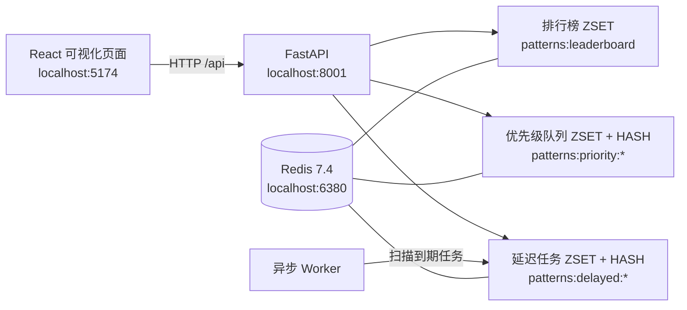
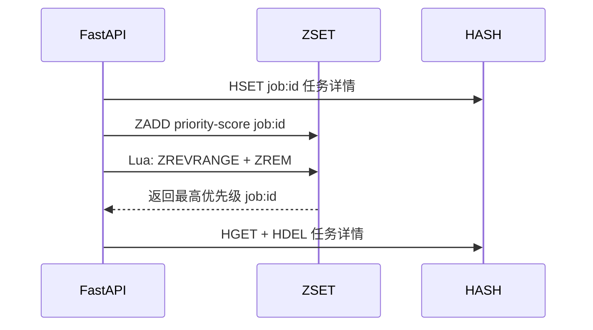
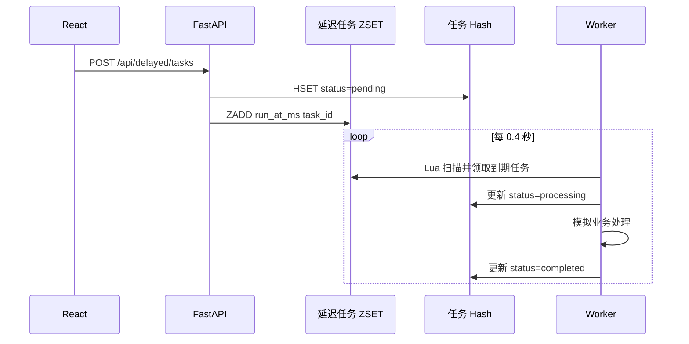

# Redis 业务模式实验台：排行榜、优先级队列、延迟任务

## Demo 目的

用一个 React 可视化页面和 FastAPI 接口，把三种常见 Redis 业务模式放到同一份实验台中：

- 使用 Sorted Set 实现实时排行榜。
- 使用 Sorted Set + Hash 实现优先级队列，并保证同优先级任务按提交顺序 FIFO 出队。
- 使用 Sorted Set 保存执行时间、Hash 保存任务状态，由后台 worker 实现延迟任务。

三个面板相互独立，但共享同一套 FastAPI、Redis 连接和轮询机制。页面每秒读取一次最新状态，可以直接观察 Redis 数据结构变化对业务行为的影响。

## 涉及的 Redis 知识点

| 模式 | Redis 结构 | 核心命令/机制 | 解决的问题 |
| --- | --- | --- | --- |
| 排行榜 | Sorted Set | `ZINCRBY`、`ZREVRANGE`、`ZREVRANK` | 按积分实时排名，天然支持 Top N |
| 优先级队列 | Sorted Set + Hash | `ZADD`、`ZREVRANGE`、`ZREM`、Lua | 高优先级先出队，同优先级 FIFO |
| 延迟任务 | Sorted Set + Hash | `ZADD`、`ZRANGEBYSCORE`、`ZREM`、`HSET` | 按执行时间排序，worker 扫描到期任务 |

### 总体结构



### 1. 排行榜

每位玩家是 Sorted Set 的 member，积分是 score：

```text
ZINCRBY patterns:leaderboard 100 Eve
ZREVRANGE patterns:leaderboard 0 9 WITHSCORES
```

`ZINCRBY` 在玩家不存在时会自动创建，并返回累加后的积分。`ZREVRANGE` 按 score 从高到低读取排名，时间复杂度为 `O(log N + M)`，其中 `M` 是返回的玩家数量。

前端的排名条长度按当前 Top N 中的最高分归一化，只用于可视化，不会改变 Redis 中的数据。

### 2. 优先级队列

优先级队列不能只把 priority 直接当作 score，否则同优先级任务的出队顺序会由 member 字典序决定，无法表达 FIFO。本 Demo 使用复合 score：

```text
score = priority * 2^32 + (2^32 - 1 - sequence % 2^32)
```

- priority 越大，score 越大，`ZREVRANGE queue 0 0` 越先取得高优先级任务。
- 同一 priority 下，sequence 越小，score 越大，因此先提交的任务先出队。
- 任务详情保存在 Hash 中，ZSET 的 member 只保存短任务 ID，避免在 Redis member 中携带较大的 JSON。
- 消费队首时使用 Lua 把“读取最高分 member”和“删除该 member”合并为一个原子操作，避免两个消费者拿到同一个任务。



### 3. 延迟任务

延迟任务的执行时间使用毫秒时间戳作为 ZSET score：

```text
ZADD patterns:delayed:tasks <run_at_ms> <task_id>
ZRANGEBYSCORE patterns:delayed:tasks -inf <now_ms> LIMIT 0 5
```

后台 worker 每 0.4 秒执行一次扫描：

1. 用 Lua 原子查找并移除所有已到期任务。
2. 将任务状态更新为 `processing`。
3. 用 `asyncio.sleep(duration_seconds)` 模拟业务处理耗时。
4. 将任务状态更新为 `completed`，并记录完成时间。



页面可以暂停或恢复自动 worker，也可以点击“立即扫描”手动触发一次到期检查。暂停后任务仍会在 ZSET 中等待，恢复后立即被领取。

## 目录或关键文件说明

```text
demo-redis-patterns/
├── README.md                    # 原理、命令、接口与运行说明
├── Makefile                    # 依赖、Redis、前后端和日志快捷命令
├── docker-compose.yml          # Redis 7.4 单实例与 AOF 持久化
├── .env.example                # Redis 端口和连接示例
├── backend/
│   ├── __init__.py
│   ├── main.py                 # FastAPI 路由和应用生命周期
│   ├── store.py                # 三类 Redis 数据结构与 Lua 脚本
│   └── worker.py               # 延迟任务后台消费者
└── frontend/
    ├── package.json
    ├── vite.config.js          # /api 代理到 FastAPI
    ├── index.html
    └── src/
        ├── App.jsx             # 三个可视化面板与交互逻辑
        ├── main.jsx
        └── styles.css          # 响应式暗色可视化样式
```

后端没有新增 Python 依赖，继续使用仓库根目录的 `pyproject.toml`、`uv.lock` 和 `.venv`，其中已包含 `redis`、`fastapi`、`uvicorn`。

## 运行前置条件

- Docker Desktop 或 Docker Engine + Compose v2。
- `uv`。
- Node.js 18+ 与 npm。
- 默认端口 `6380`、`8001`、`5174` 未被占用。

## 启动或运行方式

### 一键启动（推荐）

```bash
cd /Users/zhengjie/Github/R/demo-redis-patterns
make dev
```

`make dev` 会：

1. 同步根目录 Python 依赖。
2. 启动 Redis 7.4，端口为 `6380`。
3. 安装 React 依赖。
4. 使用 macOS `screen` 在后台启动 FastAPI 和 Vite。

启动后访问：

- 可视化页面：<http://localhost:5174>
- FastAPI 文档：<http://localhost:8001/docs>
- Redis：`localhost:6380`

其他常用命令：

```bash
make status   # 查看 Redis 容器与前后端进程
make logs     # 实时查看前后端日志
make stop     # 停止前后端进程，保留 Redis
make cli      # 打开 Redis CLI
make down     # 删除 Redis 容器和数据卷
make clean    # down + 删除 node_modules / .logs
```

### 分终端启动

终端一启动 Redis 和 FastAPI：

```bash
cd /Users/zhengjie/Github/R/demo-redis-patterns
make api
```

终端二启动 React：

```bash
cd /Users/zhengjie/Github/R/demo-redis-patterns
make frontend
```

### 自定义端口

```bash
make dev REDIS_PORT=6390 API_PORT=8011 FRONTEND_PORT=5180
```

自定义前端端口时，可以同时调整 `.env` 中的 `CORS_ORIGINS`。开发模式通常通过 Vite 的 `/api` 代理访问后端，不依赖浏览器 CORS。

## HTTP API

| 方法 | 路径 | 用途 |
| --- | --- | --- |
| `GET` | `/api/health` | 查看 Redis、worker 和三类数据统计 |
| `GET` | `/api/leaderboard?limit=12` | 获取排行榜 |
| `POST` | `/api/leaderboard/score` | 增减玩家积分 |
| `POST` | `/api/leaderboard/reset` | 重置排行榜示例数据 |
| `GET` | `/api/priority/queue?limit=12` | 查看优先级队列和最近消费记录 |
| `POST` | `/api/priority/jobs` | 创建优先级任务 |
| `POST` | `/api/priority/consume` | 原子消费最高优先级任务 |
| `POST` | `/api/priority/reset` | 恢复优先级队列示例数据 |
| `GET` | `/api/delayed/tasks` | 查看延迟任务和状态统计 |
| `POST` | `/api/delayed/tasks` | 创建延迟任务 |
| `POST` | `/api/delayed/run-due` | 手动扫描一次到期任务 |
| `POST` | `/api/delayed/worker` | 暂停或恢复自动 worker |
| `POST` | `/api/delayed/reset` | 清空延迟任务记录 |

积分修改示例：

```bash
curl -X POST http://localhost:8001/api/leaderboard/score \
  -H 'Content-Type: application/json' \
  -d '{"player":"Eve","score":100}'
```

创建优先级任务：

```bash
curl -X POST http://localhost:8001/api/priority/jobs \
  -H 'Content-Type: application/json' \
  -d '{"name":"审核退款","priority":9}'
```

创建延迟任务：

```bash
curl -X POST http://localhost:8001/api/delayed/tasks \
  -H 'Content-Type: application/json' \
  -d '{"name":"发送优惠券","delay_seconds":3,"duration_seconds":2}'
```

## 预期输出或可观察现象

1. 打开 <http://localhost:5174>，顶部显示 Redis 在线，并显示排行榜、队列、延迟任务和 worker 的实时统计。
2. 在排行榜输入玩家和积分变化，点击“更新积分”：
   - 已有玩家会累加积分；新玩家会自动创建。
   - 用户排名条和名次随 `ZINCRBY` 返回值变化。
3. 向优先级队列提交多个不同优先级的任务：
   - 优先级更高的任务显示在列表顶部。
   - 连续提交两个同优先级任务时，先提交的任务先显示。
   - 点击“消费队首”后，最高优先级任务进入“最近消费”区域。
4. 创建 `delay_seconds=3`、`duration_seconds=2` 的延迟任务：
   - `0~3s`：状态为“等待中”，进度条随倒计时推进。
   - 到期后：状态短暂变为“处理中”，约 2 秒后变为“已完成”。
   - 暂停 worker 后创建短延迟任务，任务会保持 pending；恢复 worker 后自动完成。
5. 可以在 Redis CLI 直接观察：

   ```bash
   make cli
   > ZREVRANGE patterns:leaderboard 0 9 WITHSCORES
   > ZREVRANGE patterns:priority:queue 0 9 WITHSCORES
   > ZRANGE patterns:delayed:tasks 0 -1 WITHSCORES
   > HGETALL patterns:delayed:task-data
   ```

## 清理方式

停止前后端但保留 Redis 数据：

```bash
make stop
```

删除 Redis 容器和数据卷：

```bash
make down
```

连同前端依赖和日志一起清理：

```bash
make clean
```

根目录 `.venv` 由整个项目共享，本 Demo 不会删除它。

## 常见问题

- **端口被占用**：修改 `REDIS_PORT`、`API_PORT`、`FRONTEND_PORT`，并同步检查 `.env` 与 `vite.config.js` 的代理目标。
- **页面显示 Redis 未连接**：执行 `make up`，再运行 `make status` 检查 `demo-redis-patterns` 容器是否 healthy。
- **延迟任务一直处于等待中**：检查页面上的 worker 是否被暂停；也可以点击“立即扫描”手动领取一次。
- **同优先级任务顺序不符合预期**：当前复合 score 使用 32 位 sequence 作为 FIFO 序号，达到 `2^32` 后会发生回绕。学习 Demo 足以覆盖常见场景，生产环境应使用多优先级队列、Redis Streams Consumer Group，或引入更完整的 job scheduler。
- **worker 领取任务后进程崩溃**：当前 Demo 没有 visibility timeout 和失败重试，任务可能停留在 `processing`。生产系统需要增加任务心跳、超时回收、重试次数和死信队列。
- **多实例重复消费**：Demo 默认只运行一个 worker。扩展多个 worker 时，应使用 Lua 原子领取、Streams Consumer Group 或分布式锁，并对失败重试做幂等设计。
- **排行榜只展示 Top N**：`ZREVRANGE` 只读取指定区间；如果玩家规模很大，不要使用 `ZRANGE key 0 -1` 读取完整榜单。
- **Redis 持久性**：Compose 开启了 AOF，`appendfsync everysec` 适合学习环境；生产环境的持久化策略需要结合 RPO/RTO 和数据重要性评估。
- **示例数据重复创建**：启动时仅在对应 Key 为空时写入示例数据；需要重新开始时点击页面的“重置”按钮，或执行 `make down` 后重新启动。
