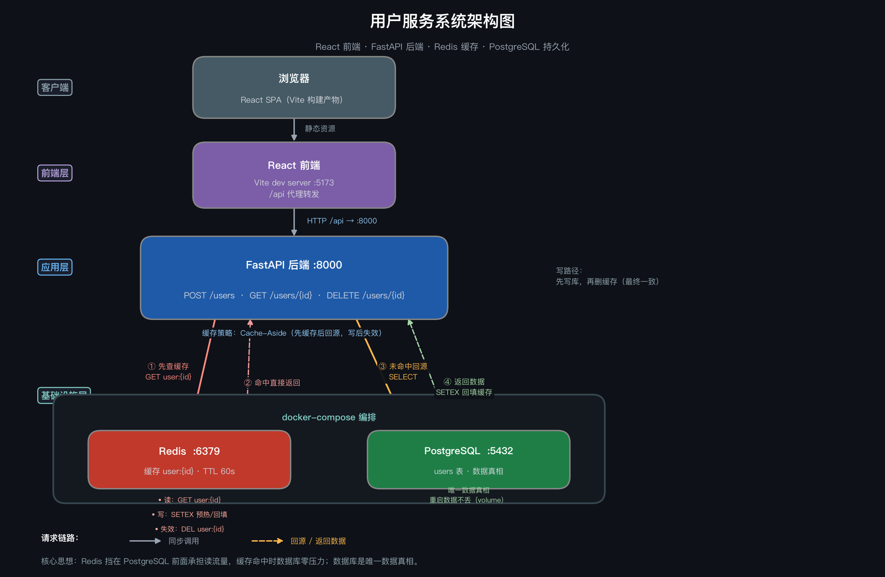

# demo-user-service：Python + React + Redis + PostgreSQL 用户服务

## Demo 目的

搭建一个全栈用户服务（含 **10000 条种子数据**），通过三个并列接口直观对比
**直接查 PostgreSQL**、**走 Redis 缓存（无防护）** 与
**走 Redis 缓存 + 空值缓存（防穿透）** 的响应差异，演示
Cache-Aside 模式、缓存穿透防护（Cache Null）与缓存雪崩防护（TTL 抖动）
在大数据量场景下的价值。

## 系统架构设计图



## 涉及的 Redis 知识点

- **缓存（Cache-Aside 模式）**：读请求先查 Redis，未命中回源 PostgreSQL 并回填缓存
- **缓存穿透防护（空值缓存 / Cache Null）**：用户不存在时写入占位值 `__NULL__`
  （TTL 较短，默认 30 秒），后续请求命中空值缓存直接返回，不再打到数据库
- **缓存写策略**：写库后 `SETEX` 预热（同时覆盖可能存在的空值缓存）；删库后 `DEL` 失效，保证最终一致
- **过期时间（TTL）**：正常缓存键 `user:{id}` 默认 60 秒；空值缓存默认 30 秒（`NULL_CACHE_TTL`）
- **缓存雪崩防护（TTL 随机扰动 / Jitter）**：写入缓存时在基础 TTL 上叠加
  `[0, CACHE_TTL_JITTER]` 秒随机值（默认 0~30 秒），让大量键错峰过期，
  避免同时失效引发数据库瞬时压力；`/cache/warm-batch?jitter=false`
  提供"统一 TTL"对照模式，配合 `/cache/ttl-distribution` 可直观看到分布差异
- **数据一致性**：先更新数据库再删除缓存
- **键命名规范**：`user:{id}` 冒号分隔的层级命名
- **性能对比**：同一数据分别走"直连数据库"与"Redis 缓存"两条路径，量化延迟差异
- **批量预热优化**：`/cache/warm-batch` 使用 Redis pipeline 批量写入，减少逐键网络往返；每个键仍单独生成 TTL 抖动
- **种子数据补齐**：服务启动时只插入缺失的 `1~10000` 用户 ID，不重复覆盖已有用户；多 worker 启动时通过 PostgreSQL 事务锁串行检查，并同步自增序列

## 目录与关键文件

```text
demo-user-service/
├── docker-compose.yml        # PostgreSQL + Redis 一键启动
├── backend/                  # FastAPI 后端
│   ├── .env.example          # 示例配置（无真实密码）
│   └── app/
│       ├── main.py           # API 路由（含缓存与穿透防护逻辑）
│       ├── config.py         # 配置（环境变量）
│       ├── database.py       # PostgreSQL 连接
│       ├── models.py         # User ORM 模型
│       ├── schemas.py        # Pydantic 模型
│       └── cache.py          # Redis 客户端与缓存键约定
├── frontend/                 # React (Vite) 前端
│   ├── vite.config.js        # /api 代理到后端 8000 端口
│   └── src/App.jsx           # 创建/查询用户界面，对比查询耗时
└── assets/
    └── 系统架构图.png        # 系统架构设计图
```

## 运行前置条件

- Docker 与 Docker Compose（启动 PostgreSQL / Redis）
- Python 3.9+ 与 [uv](https://docs.astral.sh/uv/)（`pip install uv` 或 `brew install uv`）
- Node.js 18+

> **依赖管理说明**：后端 Python 依赖统一由仓库根目录的 `pyproject.toml` /
> `uv.lock` 管理，所有 demo 共享根目录的 `.venv`。本 demo 不再维护独立的
> `backend/pyproject.toml` 与 `backend/uv.lock`；如需新增后端依赖，请在
> 仓库根目录执行 `uv add <package>`。

## 启动方式

### 方式一：Makefile 一键启动（推荐）

```bash
cd demo-user-service
make dev        # 自动安装依赖、启动 PostgreSQL/Redis、后台启动前后端
```

启动后访问：

- 前端页面：<http://localhost:5173>
- 后端 API 文档：<http://localhost:8000/docs>

其他常用命令：

```bash
make status     # 查看容器与前后端运行状态
make logs       # 实时查看前后端日志（.logs/ 目录）
make stop       # 停止前后端进程（Docker 容器保持运行）
make down       # 停止前后端并删除 Docker 容器与数据卷
make clean      # 额外清理 node_modules / .logs（Python 依赖在根目录 .venv）
```

> 前后端通过 macOS 自带的 `screen` 在独立会话中运行，与终端解耦，
> 关闭终端不会中断服务；日志写入 `.logs/backend.log` 与 `.logs/frontend.log`。

### 方式二：手动分步启动

```bash
# 1. 启动 PostgreSQL 和 Redis
cd demo-user-service
docker compose up -d

# 2. 启动后端（依赖使用仓库根目录的 uv 项目，共享根目录 .venv）
cd backend
cp .env.example .env
uv --project .. sync                                  # 按根目录 pyproject.toml + uv.lock 安装依赖
uv --project .. run uvicorn app.main:app --reload --port 8000

# 3. 启动前端（新开终端）
cd frontend
npm install
npm run dev        # http://localhost:5173
```

## 预期输出与可观察现象

1. 打开 `http://localhost:5173`，页面顶部显示数据库总用户数（10000 条）。
2. 输入任意用户 ID（1~10000），点击 **"查询对比"**：
   - 三个卡片分别显示 `GET /users/db/:id`、`GET /users/cache-unsafe/:id`（无防护）
     与 `GET /users/cache/:id`（空值缓存防穿透）的耗时与数据。
   - 第一次未命中时三者耗时接近；再次查询或点 **"先预热缓存"** 后，
     两个缓存接口耗时显著下降（通常 < 5ms）。
3. **缓存穿透测试**：输入一个不存在的 ID（如 10001 以上），点击 **"发起穿透测试"**：
   - 无防护接口 `/users/cache-unsafe/:id` 每次请求都会回源 PostgreSQL（`db_hit: true`）。
   - 有防护接口 `/users/cache/:id` 第一次回源并写入空值缓存，第二次起
     命中空值缓存直接返回（`db_hit: false`），不再打到数据库。
4. 可用命令行直接观察 Redis 中的缓存键：

   ```bash
   docker exec -it demo-user-redis redis-cli
   > KEYS user:*
   > GET user:1          # JSON 缓存内容
   > TTL user:1          # 剩余过期秒数
   > GET user:999999     # 空值缓存：__NULL__（查询过不存在的 ID 后出现）
   > TTL user:999999     # 空值缓存 TTL（默认 30 秒）
   ```

5. **缓存雪崩演示**：在"缓存雪崩演示"区域点击 **"模拟雪崩（统一 TTL）"** 或
   **"防雪崩预热（错峰 TTL）"**，批量预热 200 个用户缓存后，页面用条形图展示
   当前 `user:*` 键的 TTL 分布：
   - 统一 TTL：所有键集中在一个 TTL 桶，将同时过期（雪崩诱因）。
   - 错峰 TTL：键散落在 60~90 秒的多个桶中，过期时间点被拉开。
6. 后端 API 文档：`http://localhost:8000/docs`（Swagger UI），其中
   `/users/db/{id}`、`/users/cache-unsafe/{id}` 与 `/users/cache/{id}`
   分别对应"直连数据库"、"缓存无防护"与"缓存 + 防穿透"三条路径；
   `/cache/warm-batch`、`/cache/ttl-distribution`、`/cache/all`
   用于雪崩演示与缓存重置。

   `/cache/ttl-distribution` 的 `limit` 参数限制在 `1~10000`，默认扫描最多 2000 个键，避免请求无界遍历 Redis 缓存空间。

## 清理方式

```bash
docker compose down -v              # 停止并删除容器与数据卷
rm -rf frontend/node_modules .logs  # 清理前端依赖与日志（Python 依赖在根目录 .venv，按需自行清理）
```

## 常见问题

- **端口占用**：5432 / 6379 / 8000 / 5173 被占用时，修改 `docker-compose.yml`
  的端口映射或 `.env` / `vite.config.js` 中的配置。
- **后端连不上数据库**：确认 `docker compose ps` 中两个容器均 healthy，
  且 `.env` 中 `DATABASE_URL` 与 compose 中的账号一致。
- **种子数据重复**：种子数据仅在 `users` 表为空时写入；如需重置，执行
  `docker compose down -v` 后重新启动。
- **查询不存在的 ID 返回的不是 404**：防穿透接口 `/users/cache/{id}` 命中空值缓存时
  返回 200 + `user: null`（演示用，便于观察 `db_hit` 字段）；如需严格 REST 语义可改回 404。
- **空值缓存期间创建同 ID 用户**：`POST /users` 会用真实数据 `SETEX` 覆盖空值缓存；
  若空值缓存 TTL 内出现脏读，可调小 `NULL_CACHE_TTL`。
- **TTL 抖动带来的副作用**：键的实际过期时间不再固定，而是
  `[CACHE_TTL, CACHE_TTL + CACHE_TTL_JITTER]` 区间内的随机值；
  对过期精度要求极高的场景应调小或关闭抖动（`CACHE_TTL_JITTER=0`）。
- **前端跨域报错**：开发环境通过 Vite 的 `/api` 代理转发，请勿直接请求
  `http://localhost:8000`。
