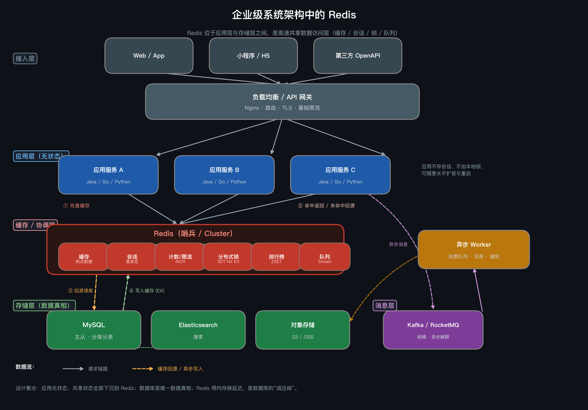

# Redis 的用途与在企业系统架构中的位置

记录时间：2026-09-17 00:15:24 (Asia/Shanghai)

## 概念简介

Redis（Remote Dictionary Server）是一个开源的、基于内存的键值（Key-Value）存储系统，支持 String、List、Hash、Set、Sorted Set、Stream、Bitmap、HyperLogLog 等多种数据结构。它常被当作"内存数据库 / 缓存 / 消息中间件"来使用。

它的核心特点：

- **基于内存**：读写延迟通常在微秒~毫秒级，单机可达 10 万+ QPS。
- **丰富的数据结构**：不只是简单的 KV，可以直接在服务端完成计数、排序、去重等操作。
- **单线程事件循环处理命令**（6.0 后网络 IO 支持多线程）：避免了锁竞争，单个命令天然原子。
- **可持久化**：RDB 快照 + AOF 日志，保证重启后数据可以恢复。
- **高可用与扩展**：主从复制、哨兵（Sentinel）、集群（Cluster）。

## Redis 的主要用途

### 1. 缓存（最核心用途）

- **数据库缓存**：把 MySQL 等数据库中的热点数据放入 Redis，应用先查 Redis，命中则直接返回（Cache-Aside 模式）。
- **页面 / 接口缓存**：缓存渲染好的 HTML 片段或 API 响应。
- **对象缓存**：序列化后的业务对象，如用户资料、商品详情。
- **作用**：降低数据库压力，把响应时间从几十毫秒降到 1 毫秒以内。

### 2. 会话存储（Session）

- 分布式系统中，用户 Session 存在 Redis，多台应用服务器共享，解决"Session 粘滞"问题。
- 典型场景：登录态 token -> 用户信息，配合过期时间自动失效。

### 3. 计数器与限流

- `INCR` / `DECR` 天然原子，适合做：阅读量、点赞数、库存扣减、接口限流（固定/滑动窗口）。
- 结合 `EXPIRE` 可实现"每分钟最多调用 N 次"的限流逻辑。

### 4. 排行榜 / 延时队列

- **Sorted Set（ZSET）**：按分数排序，天然适合积分榜、热搜榜、销量榜。
- 分数设为时间戳即可做**延时队列**：用 `ZRANGEBYSCORE` 捞到期的任务。

### 5. 分布式锁

- `SET key value NX EX 30`（不存在才设置 + 自动过期）实现互斥锁。
- 用于防止定时任务重复执行、库存超卖等并发场景。
- 注意：严谨场景需要 RedLock 或 fencing token，避免锁误释放。

### 6. 消息队列 / 发布订阅

- `PUBLISH` / `SUBSCRIBE`：简单的实时消息广播（如在线人数推送）。
- `LPUSH` + `BRPOP`：简易任务队列。
- **Stream（5.0+）**：带消费组、消息确认的生产级消息队列。

### 7. 其他典型场景

- **验证码 / 短信码**：`SET code 123456 EX 300`，5 分钟自动过期。
- **防重 / 幂等**：用 `SETNX` 标记已处理的请求 ID。
- **签到 / 活跃用户统计**：Bitmap `SETBIT`，千万级用户只占几 MB。
- **基数统计**：HyperLogLog 估算 UV，误差 <1%，每 key 只占 12KB。
- **地理位置**：GEO 命令实现"附近的人 / 门店"。
- **共同好友 / 标签交集**：Set 的 `SINTER` / `SINTERCARD`。

## 在企业系统架构中的位置

Redis 通常位于**应用层与数据库层之间**，作为高速数据访问层，是典型的"旁路"组件：

```text
                   ┌──────────────────┐
                   │   客户端 / 前端    │
                   └────────┬─────────┘
                            │
                   ┌────────▼─────────┐
                   │  负载均衡 (Nginx)  │
                   └────────┬─────────┘
                            │
              ┌─────────────┼─────────────┐
              │             │             │
        ┌─────▼─────┐ ┌─────▼─────┐ ┌─────▼─────┐
        │ 应用服务 A  │ │ 应用服务 B  │ │ 应用服务 C  │   ← 无状态，可水平扩展
        └─────┬─────┘ └─────┬─────┘ └─────┬─────┘
              │             │             │
              └─────────────┼─────────────┘
                            │
              ┌─────────────┴─────────────┐
              │                           │
        ┌─────▼──────┐             ┌──────▼──────┐
        │   Redis     │             │   MySQL      │   ← 持久化存储（数据真相）
        │ 缓存/会话/锁 │             │ 主从 + 分库   │
        │ 队列/排行榜  │             └─────────────┘
        └─────┬──────┘
              │
        ┌─────▼──────┐
        │ Redis 集群  │   哨兵 / Cluster，主从复制
        └────────────┘
```

### 各层职责

| 层级 | 组件 | 职责 | Redis 的角色 |
|------|------|------|--------------|
| 接入层 | Nginx / 网关 | 路由、限流 | 限流规则、token 黑名单可存 Redis |
| 应用层 | Java/Go/Python 服务 | 业务逻辑（无状态） | 通过客户端访问 Redis |
| **缓存层** | **Redis** | **热点数据、共享状态、协调** | **本层主角** |
| 存储层 | MySQL / ES / MQ | 数据持久化、检索、异步 | Redis 是它的"减压阀" |

### 为什么应用要"无状态"

企业架构中应用服务器要随时扩容、重启、替换，所以**任何需要跨请求、跨实例共享的状态都放到 Redis**：

- 登录会话 → Redis（而不是应用内存）
- 分布式锁 → Redis（而不是 JVM 锁）
- 计数器 → Redis（而不是本地变量）

这样应用实例变成"纯计算单元"，可以随意增减。

## 使用示例

以最常见的"缓存用户信息"为例（Cache-Aside 模式）：

```bash
# 1. 应用先查缓存
GET user:1001

# 2. 缓存未命中（返回 nil），应用回源查 MySQL，然后写入缓存
SET user:1001 '{"name":"Alice","age":28}' EX 3600

# 3. 后续请求直接命中缓存，不再访问数据库
GET user:1001
# => {"name":"Alice","age":28}

# 4. 用户信息变更时，删除缓存（下次读取时重新加载）
DEL user:1001
```

## 常见问题和注意事项

| 问题 | 说明 | 应对 |
|------|------|------|
| 缓存穿透 | 查询不存在的数据，每次都打到数据库 | 缓存空值、布隆过滤器 |
| 缓存击穿 | 热点 key 过期瞬间大量请求打到数据库 | 互斥锁重建、逻辑过期 |
| 缓存雪崩 | 大量 key 同时过期 / Redis 宕机 | 过期时间加随机抖动、高可用部署 |
| 数据一致性 | 缓存与数据库不一致 | 先更新数据库再删缓存、延迟双删、binlog 订阅 |
| 内存不足 | 内存是有限的 | 设置 maxmemory + 淘汰策略（LRU/LFU）、合理设置 TTL |
| 大 key / 热 key | 单 key 过大或过热拖垮实例 | 拆分大 key、本地缓存兜底热 key |
| 分布式锁误删 | 锁过期后被别人误释放 | value 存唯一标识，Lua 脚本原子释放 |

## 与相关概念的区别或联系

| 对比 | Redis | 其他 |
|------|-------|------|
| vs MySQL | 内存、快、容量小、适合热点数据 | 磁盘、慢、容量大、数据真相 |
| vs Memcached | 数据结构丰富、可持久化、支持集群 | 纯 KV、多线程、更简单 |
| vs Kafka | 轻量消息（Pub/Sub、Stream），适合中小流量 | 专业消息队列，吞吐和可靠性更强 |
| vs 本地缓存（Caffeine 等） | 多实例共享、数据一致 | 更快（无网络），但各实例数据独立 |

一句话总结：**Redis 是应用与数据库之间的"高速共享内存层"，用空间（内存）换时间（延迟），并承担了分布式系统中共享状态与协调的职责。**

## 系统架构设计图



图中数据流说明：

1. **① 先查缓存**：应用收到请求后优先访问 Redis。
2. **② 命中返回 / 未命中回源**：缓存命中直接返回（毫秒级）；未命中则进入回源流程。
3. **③ 回源读库**：缓存未命中时查询 MySQL（数据真相）。
4. **④ 写入缓存 (EX)**：把数据库结果写回 Redis 并设置过期时间，后续请求直接命中。
5. 写路径：先更新数据库，再删除对应缓存（`DEL`），由下次读取时重建，保证最终一致。
6. 异步路径：应用将非实时任务投递到 Kafka，由异步 Worker 消费后写库 / 发通知，实现削峰填谷。
