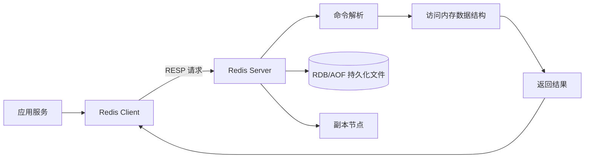
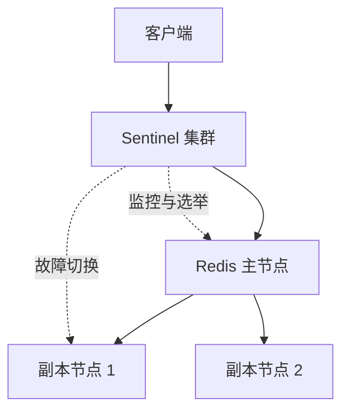
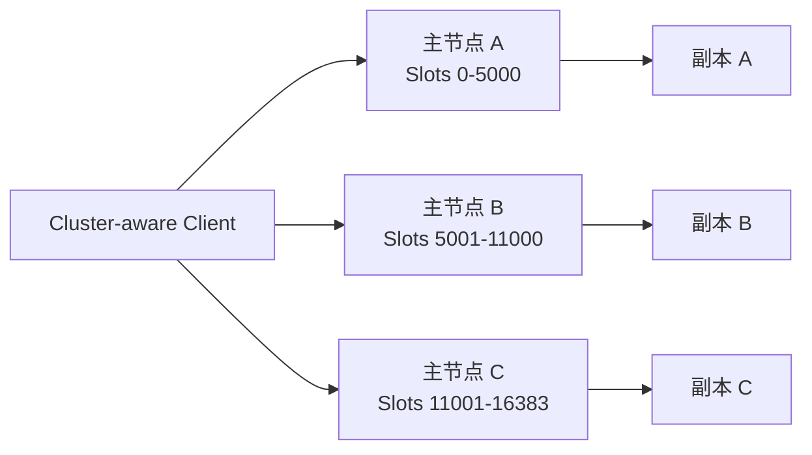
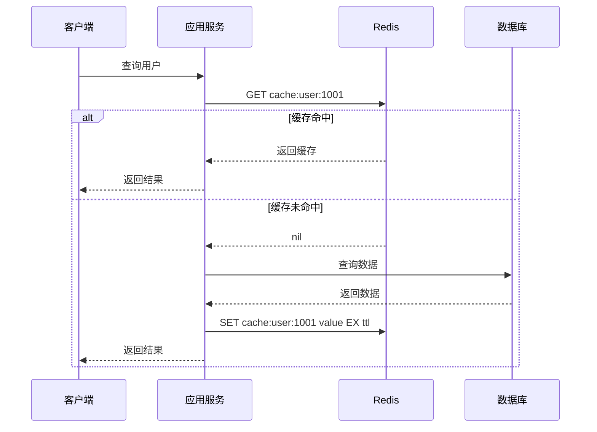

# Redis 核心原理与实践

记录时间：2026-09-18 14:50:19 (Asia/Shanghai)

> 本文是一份系统性的 Redis 入门与实践总结，覆盖 Redis 的定位、数据结构、常用命令、内存与执行模型、持久化、高可用、集群、缓存设计和运维注意事项。
>
> 关联旧记录：[Redis 的用途与在企业系统架构中的位置](./2026-09-17-001524-Redis用途与架构位置.md)。旧记录更侧重 Redis 在企业架构中的职责；本文进一步展开它是如何工作以及如何正确使用。

## 一、概念简介

Redis（Remote Dictionary Server）是一个开源的、面向网络的内存数据结构服务器。它以 Key-Value 形式组织数据，但 Value 不局限于普通字符串，而是可以是 String、List、Hash、Set、Sorted Set、Stream 等数据结构。

Redis 经常被称为“内存数据库”或“缓存”，但这两个称呼都只描述了它的一部分能力。更准确地说，Redis 是一个提供丰富数据结构和原子操作的高速数据服务，常见职责包括：

- 作为数据库前面的缓存层，降低关系型数据库或搜索引擎的访问压力。
- 作为分布式系统中的共享状态存储，例如 Session、验证码、幂等标记和限流计数器。
- 作为轻量级消息组件，例如 Pub/Sub、List 队列和 Stream 消费组。
- 作为协调组件，例如分布式锁、排行榜、延迟任务和选举辅助状态。
- 作为统计组件，例如计数、去重、UV 估算、签到和地理位置检索。

### 1. Redis 的核心特点

| 特点 | 含义 | 带来的价值 |
|---|---|---|
| 内存优先 | 热数据主要在内存中处理 | 访问延迟低，适合高频读写 |
| 数据结构丰富 | Value 可以是多种抽象结构 | 许多计数、排序、去重操作可以在服务端完成 |
| 命令原子性 | 单条命令执行期间不会被另一条命令插入 | 适合计数、状态变更和并发协调 |
| 网络服务化 | 通过 TCP 等方式被多个应用实例访问 | 多台应用服务器可以共享状态 |
| 可持久化 | 支持 RDB 快照和 AOF 追加日志 | 重启后可以恢复数据，具体可靠性取决于配置 |
| 可复制与高可用 | 支持主从复制、Sentinel 和 Cluster | 可以提高可用性并扩展容量 |
| 可编程 | 支持 Lua 脚本以及部分版本提供的 Functions | 可以把多步检查与修改放到服务端原子执行 |

### 2. Redis 不是什么

理解边界与理解优点同样重要：


- Redis 不是关系型数据库。它没有以 SQL 为核心的复杂关联查询、事务隔离级别和完善的多表约束模型。
- Redis 不是“永不丢数据”的存储。即使启用了持久化，故障时仍可能丢失最近一段时间的数据，是否能接受取决于业务配置。
- Redis 不是所有消息场景的最佳消息队列。Pub/Sub 没有消息堆积和确认机制；Stream 虽然更强，但在极大规模日志吞吐、复杂重放和长期保留方面仍要与 Kafka 等专业系统比较。
- Redis 不是无限大的内存。每个 Key、对象、指针、数据结构都有额外内存开销，业务数据量必须与内存预算匹配。

## 二、Redis 的基本工作模型

### 1. 从客户端到命令执行

应用通过 Redis 客户端发送命令。客户端负责连接管理、协议编码、连接池、超时和部分数据序列化；Redis 服务端负责解析命令、访问内存中的数据结构并返回结果。



Redis 的经典执行模型可以概括为：一个实例在事件循环中接收并按顺序执行命令。这样做的好处是避免了大量线程之间的锁竞争，因此单个命令天然具有较强的原子性。

现代 Redis 版本可以使用多线程处理部分网络 I/O，但这不等于所有业务命令都会并行执行。编写业务逻辑时，仍然应该把一个 Redis 实例看成“命令按顺序执行的高速状态机”，并特别注意长耗时命令会阻塞其他请求。

### 2. 单条命令为什么通常是原子的

假设两个客户端同时执行：

```text
INCR page:1001:views
```

Redis 会完整执行一条 `INCR`，再执行另一条 `INCR`，不会出现“两个客户端同时读到 10，然后都写回 11”的普通读改写竞争。因此 `INCR`、`HINCRBY`、`SADD` 等命令适合用于计数和集合更新。

但“单命令原子”不代表“任意多条命令自动组成事务”。例如下面两条命令之间可能插入其他客户端的操作：

```text
GET stock:1001
DECR stock:1001
```

如果需要把检查和修改绑定在一起，应考虑单条命令、`MULTI/EXEC`、`WATCH`、Lua 脚本或 Functions。

## 三、Redis 的数据结构

### 1. String

String 是 Redis 最基础、使用最广泛的数据类型。它可以保存文本、数字或任意二进制数据，因此适合保存序列化后的 JSON、Token、计数值和简单标志。

常用命令：

```text
SET user:1001:name Alice
GET user:1001:name

SET page:1001:views 0
INCR page:1001:views
INCRBY account:1001:balance 100

MSET config:a on config:b off
MGET config:a config:b
```

典型用途：

- 缓存一个完整对象，例如 `user:1001` 对应序列化后的用户资料。
- 保存 Session、Token、验证码和幂等键。
- 使用 `INCR` 实现浏览量、点赞量和限流计数。
- 使用 `SETBIT` 等命令把 String 当作位图使用。

注意事项：

- JSON 放进 String 后，Redis 只能整体读写；如果经常只修改一个字段，可以考虑 Hash。
- 不要把超大的对象、日志或未限制大小的请求体直接写入 Redis。
- 数字运算命令要求 Value 的内容是合法整数或浮点数，不能把普通字符串与 `INCR` 混用。

### 2. List

List 是有序的字符串列表，支持两端插入和弹出。它适合实现队列、栈、时间线和简单任务缓冲。

```text
LPUSH queue:email task-1 task-2
RPUSH queue:email task-3
LPOP queue:email
RPOP queue:email
LRANGE queue:email 0 9

BRPOP queue:email 30
```

常见模型：

- `LPUSH + BRPOP`：生产者把任务放到左端，消费者从右端阻塞获取。
- `LPUSH + LTRIM`：保存最近 N 条操作记录或最近 N 条动态。
- `LPUSH + LRANGE`：构建简单的消息时间线。

注意 `LRANGE`、`LINDEX` 以及中间位置操作在大 List 上可能需要遍历；不要把它当作随机访问数组使用。需要消息确认、消费组和重放能力时，应优先评估 Stream。

### 3. Hash

Hash 是字段到值的映射，适合表示一个对象的多个属性：

```text
HSET user:1001 name Alice age 28 city Shanghai
HGET user:1001 name
HMGET user:1001 name age
HINCRBY user:1001 login_count 1
HGETALL user:1001
```

适合场景：

- 用户资料、商品摘要、设备状态等对象型数据。
- 需要单独更新某一个字段的配置或统计信息。
- 需要对某个字段执行 `HINCRBY` 的计数。

注意事项：

- `HGETALL` 会返回整个 Hash。字段很多时，可能造成大响应和阻塞，应改用 `HSCAN` 或按需读取。
- Key 的过期时间作用于整个 Hash，不作用于单个 field。若每个字段需要独立 TTL，要拆成多个 Key 或自行维护过期字段。
- 一个 Hash 里塞入几十万甚至更多字段会形成大 Key，影响删除、迁移、持久化和故障恢复。

### 4. Set

Set 是无序且不重复的字符串集合，适合去重和集合运算：

```text
SADD user:1001:tags redis cache database
SISMEMBER user:1001:tags redis
SMEMBERS user:1001:tags
SINTER user:1001:tags user:1002:tags
SUNION user:1001:tags user:1002:tags
SREM user:1001:tags database
```

典型用途：

- 标签、兴趣、权限集合。
- 记录已经处理过的 ID，实现简单去重。
- 求共同好友、共同标签或集合交并差。
- 用 `SCARD` 统计集合大小。

集合运算的成本与参与集合的大小有关。对超大集合执行 `SINTER`、`SUNION` 或 `SMEMBERS` 时，需要评估 CPU、网络返回量和阻塞风险。

### 5. Sorted Set（ZSet）

Sorted Set 的每个成员都有一个 Score，Redis 按 Score 排序；同一成员重复写入时会更新其 Score。它非常适合排行榜、优先级队列和按时间排序的任务。

```text
ZADD leaderboard 98 user:1001 95 user:1002 91 user:1003
ZINCRBY leaderboard 3 user:1002
ZRANGE leaderboard 0 9 WITHSCORES
ZREVRANGE leaderboard 0 9 WITHSCORES
ZSCORE leaderboard user:1001
ZREM leaderboard user:1003
```

延迟任务的常见思路是把执行时间戳作为 Score：

```text
ZADD delay:jobs 1780000000 job:1001
ZRANGEBYSCORE delay:jobs -inf 1780000000 LIMIT 0 100
ZREM delay:jobs job:1001
```

实际消费时要防止多个 Worker 同时取到同一个任务，通常需要原子领取、状态标记、Lua 脚本或独立的任务组件。Sorted Set 本身不会自动替你完成“领取成功后可靠确认”。

### 6. Stream

Stream 是 Redis 提供的追加型消息日志结构，支持消息 ID、消费者组、待确认消息和重新领取，适合比 Pub/Sub 更可靠的异步处理。

```text
XADD orders * user_id 1001 action created
XGROUP CREATE orders order-workers $ MKSTREAM
XREADGROUP GROUP order-workers worker-1 COUNT 10 BLOCK 5000 STREAMS orders >
XACK orders order-workers 1710000000000-0
XPENDING orders order-workers
```

核心概念：

- Stream：按 ID 追加的消息序列。
- Consumer Group：多个消费者共同消费一个 Stream，每条消息通常交给组内一个消费者。
- Pending Entries List（PEL）：已经投递但尚未确认的消息。
- `XACK`：消费者处理成功后确认消息。
- 失败消费者下线后，可以通过 `XAUTOCLAIM` 或相关命令重新认领消息，具体命令支持取决于部署版本。

Stream 仍然需要业务侧设计重试次数、死信消息、幂等处理、保留周期和消费积压监控。

### 7. Bitmap

Bitmap 不是独立的顶层 Value 类型，而是把 String 的每一位当作 0/1 使用：

```text
SETBIT sign:2026-09-18 1001 1
GETBIT sign:2026-09-18 1001
BITCOUNT sign:2026-09-18
```

适合做按用户 ID 映射的签到、活跃标记和布尔状态统计。它的空间效率高，但必须确保 ID 范围可控；如果把一个非常大的稀疏 ID 直接映射到位偏移，可能产生意外的内存占用。

### 8. HyperLogLog

HyperLogLog 用于近似统计不重复元素数量：

```text
PFADD uv:2026-09-18 user:1001 user:1002 user:1001
PFCOUNT uv:2026-09-18
PFMERGE uv:2026-09-week uv:2026-09-18 uv:2026-09-17
```

它牺牲精确性换取极低的空间占用，适合统计 UV、独立设备数等场景；不适合需要返回具体用户列表或精确账务数据的场景。

### 9. GEO

GEO 命令可以保存经纬度并按距离检索附近对象：

```text
GEOADD shops 121.4737 31.2304 shop:1001
GEOSEARCH shops FROMLONLAT 121.47 31.23 BYRADIUS 5 km WITHDIST
```

适合附近门店、附近设备等基础地理位置查询。复杂的地理围栏、路线规划和空间分析通常需要专门的地理信息系统或搜索引擎。

### 10. Pub/Sub

Pub/Sub 是发布订阅通道：

```text
SUBSCRIBE events
PUBLISH events "user:1001 logged in"
```

它的特点是实时、简单，但消息不会为离线订阅者保留，也没有消费确认、重放和消费组。它适合实时通知、缓存失效广播等对丢失少量消息可容忍的场景；不能默认把它当作可靠队列。

### 11. Redis Stack 与模块

Redis 的核心数据结构之外，还存在通过模块扩展的能力，例如 JSON 文档、全文检索、布隆过滤器、时间序列和向量搜索。是否可用取决于部署的是哪个发行版、镜像和模块配置。

设计时要先确认目标环境支持哪些命令，不要仅因为某台开发机安装了模块，就假设生产 Redis 一定支持相同能力。

## 四、Key 设计与数据建模

### 1. Key 命名规范

推荐使用可读、稳定、可分层的命名方式：

```text
<服务>:<领域>:<对象>:<标识>:<属性>

user-service:user:1001
order-service:order:202609180001
shop-service:shop:1001:stock
rate-limit:api:/v1/orders:user:1001
```

命名建议：

- 统一使用小写和固定分隔符，避免同一概念有多种拼写。
- 把业务命名空间放在前面，降低多个服务共用实例时的冲突概率。
- Key 中避免放入不可控的用户输入，限制长度并进行规范化。
- 需要批量清理时，让 Key 能够按前缀识别，但生产环境不要依赖 `KEYS prefix*` 扫描。
- 对所有缓存 Key 明确是否需要 TTL；永久缓存必须有容量和淘汰策略说明。

### 2. Cluster Hash Tag

Redis Cluster 根据 Key 计算 Hash Slot。如果多个 Key 需要在同一个事务或 Lua 脚本中操作，可以使用花括号指定相同的 Hash Tag：

```text
cart:{user:1001}:items
cart:{user:1001}:coupon
```

两个 Key 的 `{user:1001}` 部分相同，因此会落到同一个 Slot。但 Hash Tag 会把同一类数据集中到一个节点，过度使用可能形成热点，应该在“多 Key 原子操作”和“分布均衡”之间取平衡。

### 3. 单 Key 与大 Key

Redis 的性能不仅取决于 Key 的数量，也取决于单个 Value 或集合的大小。以下对象都可能形成大 Key：

- 一个包含大量成员的 Set、Hash 或 ZSet。
- 一个超长 List 或 Stream。
- 一个几 MB 甚至更大的 String。
- 一次性返回大量成员的 `SMEMBERS`、`HGETALL` 或 `LRANGE`。

大 Key 会影响网络传输、主线程执行、RDB/AOF、主从同步、集群迁移和删除耗时。必要时应拆分 Key、分页读取、异步删除，或使用 `UNLINK` 降低删除对主线程的影响；但 `UNLINK` 也不是完全没有成本，仍需监控后台线程和内存回收。

## 五、常用命令与使用示例

### 1. 连接和基本检查

```text
redis-cli
PING
INFO server
INFO memory
DBSIZE
TTL some:key
TYPE some:key
SCAN 0 MATCH user:* COUNT 100
```

生产环境中应避免在命令行参数、脚本和日志里直接暴露真实密码。应使用安全的凭据管理、ACL、环境隔离和最小权限账号。

### 2. 设置过期时间

推荐在写入缓存时直接为 Key 设置 TTL，减少“写入成功但忘记过期”的窗口：

```text
SET cache:user:1001 '{"name":"Alice","age":28}' EX 3600
GET cache:user:1001
TTL cache:user:1001
```

常用命令：

- `EXPIRE key seconds`
- `PEXPIRE key milliseconds`
- `EXPIREAT key unix-time-seconds`
- `TTL key`、`PTTL key`
- `PERSIST key`：移除过期时间

`TTL` 返回 `-1` 通常表示 Key 存在但没有过期时间，返回 `-2` 表示 Key 不存在。具体客户端可能会把这些状态映射成不同的常量，需要查阅客户端 API。

### 3. `SET` 的条件与过期选项

```text
SET idempotent:request:abc123 done NX EX 86400
SET lock:order:1001 unique-token NX EX 30
```

- `NX`：仅当 Key 不存在时设置。
- `XX`：仅当 Key 已存在时设置。
- `EX` / `PX`：同时设置过期时间。

把“设置锁”和“设置锁的过期时间”合并到一条 `SET`，比先 `SETNX` 再 `EXPIRE` 更安全，因为后者可能在两条命令之间进程崩溃，留下没有 TTL 的永久锁。

### 4. 遍历 Key

不要在生产环境使用：

```text
KEYS user:*
```

`KEYS` 可能一次扫描整个 Key 空间，阻塞 Redis。应使用游标式的 `SCAN`，并把它看成“渐进式遍历”，而不是一次性得到严格快照：

```text
SCAN 0 MATCH user:* COUNT 100
```

应用代码也应避免每次请求都从头 `SCAN`。清理历史数据时要控制频率、批次大小和删除方式。

### 5. Pipeline

Pipeline 把多个命令批量发送，减少网络往返：

```text
SET cache:a 1
SET cache:b 2
GET cache:a
GET cache:b
```

Pipeline 能降低 RTT，但不会自动把命令变成事务；批量过大也会产生较大请求和响应，可能增加客户端内存以及 Redis 单次处理时间。应设置合理批次并配合超时。

## 六、持久化机制

Redis 的持久化解决的是“进程重启或机器故障后如何恢复数据”，不等于主从复制，也不等于备份。常见方式如下。

### 1. RDB 快照

RDB 在某个时间点把内存数据生成快照文件。触发方式可以是配置的保存条件、手动 `BGSAVE` 或故障前后的运维流程。

优点：

- 文件紧凑，适合备份和传输。
- 恢复速度通常较快。
- 适合缓存、测试环境和允许丢失一段时间数据的场景。

缺点：

- 两次快照之间的数据可能在故障时丢失。
- 生成快照通常涉及后台进程和写时复制，内存压力较高时可能增加延迟或瞬时内存占用。
- 不能把 RDB 当作实时备份。

### 2. AOF 追加日志

AOF 把执行过的写命令追加到日志中，重启时按日志恢复。常见同步策略：

| 策略 | 特点 |
|---|---|
| `appendfsync always` | 每次写操作都尽量同步，数据安全性更强，写入成本更高 |
| `appendfsync everysec` | 通常每秒同步一次，在可靠性和性能之间折中 |
| `appendfsync no` | 交给操作系统决定刷盘时机，性能可能更好但风险更大 |

AOF 会不断增长，因此需要 AOF Rewrite，将旧日志压缩成能表达当前状态的较小文件。AOF 也会受到磁盘空间、I/O、重写期间内存和恢复时间的影响。

### 3. RDB 与 AOF 如何选择

| 场景 | 重点考虑 |
|---|---|
| 纯缓存 | 可以接受重启后从数据库回源，通常更重视性能和简单运维 |
| Session、计数等可重建数据 | 根据丢失窗口和回源成本选择，通常需要至少有恢复方案 |
| 订单状态、支付辅助状态等重要数据 | 不能只依赖 Redis，必须明确主数据源、持久化、复制、备份和故障切换策略 |
| 需要更快恢复 | 评估 RDB 快照、AOF 以及二者组合；实际效果要通过压测与恢复演练验证 |

无论采用哪种方式，都需要测试：

- Redis 非正常退出后的恢复时间。
- 数据恢复后是否能被业务正确读取。
- 持久化文件是否有异地或离线备份。
- 磁盘空间不足、AOF 重写失败时的告警和处理。

## 七、过期与内存淘汰

### 1. 过期 Key 如何被删除

Redis 通常通过两种方式处理过期 Key：

- 惰性删除：访问某个 Key 时发现它已经过期，再删除并返回不存在。
- 定期主动检查：后台周期性抽样检查带 TTL 的 Key，删除已经过期的对象。

因此，过期时间不是一个到点立刻清零的精确闹钟。Key 到期后可能在短时间内仍占用内存，尤其是从未被访问且没有及时被主动采样到的 Key。

### 2. `maxmemory` 与淘汰策略

设置最大内存后，Redis 在写入导致内存超限时，会按照淘汰策略尝试删除 Key：

| 策略 | 行为 |
|---|---|
| `noeviction` | 不淘汰，写入超限时返回错误 |
| `allkeys-lru` | 在所有 Key 中近似淘汰最近最少使用的 Key |
| `volatile-lru` | 只在设置了 TTL 的 Key 中执行近似 LRU |
| `allkeys-lfu` | 在所有 Key 中近似淘汰最不常使用的 Key |
| `volatile-lfu` | 只在设置了 TTL 的 Key 中执行近似 LFU |
| `allkeys-random` | 随机淘汰任意 Key |
| `volatile-random` | 在设置了 TTL 的 Key 中随机淘汰 |
| `volatile-ttl` | 优先淘汰更快过期的 Key |

LRU/LFU 通常是抽样近似算法，不是对所有 Key 做精确全量排序。选择策略前要先确认：Redis 里是否全部是缓存、是否混有不能淘汰的数据、是否所有缓存都配置了 TTL。

### 3. 内存排查命令

```text
INFO memory
MEMORY USAGE cache:user:1001
MEMORY STATS
OBJECT ENCODING cache:user:1001
```

实际排查还应结合业务 Key 统计、采样扫描、客户端请求日志、碎片率、过期 Key 数量和大 Key/热 Key 监控。不要仅凭 `used_memory` 一个指标判断 Redis 是否健康。

## 八、事务、并发控制与脚本

### 1. `MULTI/EXEC`

```text
MULTI
SET order:1001:status paid
INCR user:1001:paid_count
EXEC
```

`MULTI` 之后命令会排队，`EXEC` 时按顺序执行。它能保证事务中的命令不会被其他客户端命令插入，但需要理解几个边界：

- Redis 事务通常没有关系型数据库意义上的回滚。
- 某一条命令运行时失败，不一定会撤销前面已经成功的命令。
- 命令排队阶段的语法或参数问题，与执行阶段的业务错误不同。
- 事务内不能长时间执行大 Key 操作，否则会阻塞其他请求。

### 2. `WATCH` 乐观锁

`WATCH` 用来检测某些 Key 在 `EXEC` 前是否被其他客户端修改：

```text
WATCH stock:1001
GET stock:1001
MULTI
DECR stock:1001
EXEC
```

如果被监视的 Key 在事务提交前发生变化，`EXEC` 会失败，应用需要重新读取、判断和重试。高竞争场景下重试可能很多，应评估是否改用 Lua、数据库原子更新或业务队列。

### 3. Lua 脚本

Lua 适合把“读取、判断、修改”组合成一个原子操作。例如只允许锁的持有者释放锁：

```lua
if redis.call('get', KEYS[1]) == ARGV[1] then
    return redis.call('del', KEYS[1])
end
return 0
```

调用时把锁 Key 放在 `KEYS[1]`，把持有者唯一标识放在 `ARGV[1]`。这样可以避免锁过期后被新持有者获得，而旧持有者又误删新锁。

Lua 的注意事项：

- 脚本在执行期间会阻塞其他命令，脚本必须短小、确定、可控。
- 不要在脚本中遍历超大集合、执行不可预测的长循环或访问外部系统。
- Cluster 环境下，脚本涉及的 Key 通常必须位于同一个 Hash Slot。
- 脚本发布和变更要有版本管理，避免不同应用实例使用不兼容的脚本语义。

部分 Redis 版本还提供 Functions/`FCALL`，可以把服务端函数持久化并复用；是否采用要结合版本、客户端支持和运维流程。

## 九、高可用与水平扩展

### 1. 主从复制

Redis Replica 通常从主节点异步复制数据。主节点把写操作传播给副本，副本可以用于读扩展或故障切换。

优点：

- 副本可以分担读流量。
- 主节点故障时有数据副本可用于恢复或切换。
- 可以通过副本做备份、检查和部分只读任务。

风险：

- 异步复制意味着主节点确认写入时，副本可能还没有收到。
- 从副本读取可能读到旧数据。
- 副本不是独立备份；主节点误删数据可能很快同步到副本。
- 复制延迟、全量同步和网络抖动都需要监控。

`WAIT` 等机制可以让客户端等待一定数量的副本确认，但它不会把 Redis 变成完整的同步复制数据库，也不能替代备份和故障演练。

### 2. Sentinel

Sentinel 主要解决 Redis 主节点的监控、故障判断、选举和自动故障切换。它不负责把一个数据集分片到多个主节点，因此 Sentinel 适合“单主节点容量和吞吐足够，但需要高可用”的场景。



客户端必须正确使用 Sentinel 提供的主节点发现能力，并处理连接重建、重试、超时和切换期间的短暂错误。

### 3. Redis Cluster

Cluster 通过 16384 个 Hash Slot 把 Key 分布到多个主节点，每个主节点还可以有副本。它同时解决容量扩展和部分吞吐扩展问题。



Cluster 的关键点：

- 客户端需要支持 `MOVED`、`ASK` 重定向，或使用集群代理。
- 默认情况下，多 Key 命令要求相关 Key 位于同一 Slot。
- 可以使用 `{...}` Hash Tag 强制相关 Key 使用同一 Slot。
- 集群扩缩容、迁移 Slot 和副本切换会引入网络与运维复杂度。
- Cluster 不是把一个大事务自动拆到多节点；跨 Slot 的原子操作仍然受限制。
- 集群环境一般只使用默认逻辑数据库，不能把多数据库理解为跨节点隔离方案。

### 4. Sentinel 与 Cluster 的选择

| 需求 | 更适合的方案 |
|---|---|
| 数据量不大，重点是主节点故障自动切换 | 主从复制 + Sentinel |
| 单节点内存或吞吐达到上限，需要分片 | Redis Cluster |
| 希望简单使用但不想管理故障切换 | 托管 Redis 服务，并确认其高可用实现 |
| 需要强一致、复杂事务和长期可靠存储 | Redis 只作为辅助组件，主数据放在更合适的系统 |

## 十、缓存设计

### 1. Cache-Aside（旁路缓存）

这是业务系统中最常见的缓存模式：应用自己负责读缓存、回源和失效。



典型读流程：

1. 查询 Redis。
2. 命中则直接返回。
3. 未命中则查询数据库。
4. 把数据库结果写入 Redis，并设置 TTL。
5. 返回结果。

典型写流程：

1. 更新数据库。
2. 删除缓存 Key。
3. 下次读取时重新加载。

“更新数据库后删除缓存”通常比“先删缓存再更新数据库”更容易控制，但在并发读写、主从延迟和删除失败时仍可能出现短暂不一致。需要严格一致性时，应考虑版本号、消息通知、事务 Outbox、CDC/binlog 或业务侧校验。

### 2. 缓存常见问题

| 问题 | 现象 | 常见原因 | 应对方式 |
|---|---|---|---|
| 缓存穿透 | 大量请求查询不存在的数据，持续打到数据库 | 恶意 ID、无效参数、缓存不保存空结果 | 参数校验、短 TTL 空值缓存、布隆过滤器、限流 |
| 缓存击穿 | 某个热点 Key 过期瞬间，大量请求同时回源 | 热点数据同时失效 | 互斥锁、单飞请求、逻辑过期、预热、随机 TTL |
| 缓存雪崩 | 大量 Key 同时过期或 Redis 整体不可用 | TTL 相同、实例宕机、网络故障 | TTL 抖动、分批预热、多级缓存、熔断降级、高可用 |
| 数据不一致 | Redis 与数据库值不同 | 更新顺序、删除失败、并发覆盖、主从延迟 | 明确一致性目标、重试/补偿、消息失效、版本校验 |
| 大 Key | 删除、迁移和访问都变慢 | 单集合或单 Value 过大 | 拆 Key、分页、分片、异步删除、限制结果集 |
| 热 Key | 单个 Key 访问极高，某个节点或线程成为瓶颈 | 流量集中到少数对象 | 本地缓存、Key 分片、热点预热、请求合并、限流 |

### 3. TTL 设计

缓存 TTL 不应全部设置成完全相同的值。可以在基础 TTL 上增加随机抖动：

```text
实际 TTL = 基础 TTL + random(0, 抖动范围)
```

这样可以降低大量 Key 同时过期的概率。TTL 也不应无限延长，否则失效机制只剩内存淘汰，难以控制数据新鲜度。

### 4. 防止击穿的互斥重建

热点 Key 失效后，可以只允许一个请求负责重建：

1. 所有请求先读缓存。
2. 未命中的请求尝试获取带 TTL 的互斥锁。
3. 获取成功的请求查询数据库并回填缓存。
4. 没拿到锁的请求短暂等待后重试，或返回降级结果。

锁的 TTL 必须覆盖正常重建时间，同时要处理重建超时、锁续期和持有者崩溃。严格正确性场景不能只依赖一个简单的“带过期分布式锁”，还要考虑租约过期后的旧请求继续写入问题。

## 十一、分布式锁、幂等与限流

### 1. 分布式锁的基本形式

```text
SET lock:order:1001 unique-token NX EX 30
```

获取成功后才能进入临界区。释放时不能直接 `DEL lock:order:1001`，应验证 Value 是否仍然是自己的唯一标识，再执行删除，通常使用 Lua 保证“比较 + 删除”原子完成。

还需要考虑：

- 业务执行超过锁 TTL 时是否续期。
- 进程暂停、网络分区、时钟和重试导致旧持有者继续执行的问题。
- 锁失效后，新持有者与旧持有者同时写入的风险。
- 严格一致性业务是否需要 fencing token，让下游资源拒绝旧租约的写入。

对于支付、库存、金融账务等场景，Redis 锁通常只能作为协调手段，不能代替数据库约束、幂等设计和最终状态校验。

### 2. 幂等标记

```text
SET request:processed:abc123 1 NX EX 86400
```

返回成功表示第一次处理，返回失败表示相同请求已经处理过或正在处理。真实业务还要区分“处理中”和“已完成”，必要时把状态、结果摘要和重试信息写入 Hash，并设计异常恢复流程。

### 3. 固定窗口限流

最简单的固定窗口可以按“用户 + 接口 + 时间窗口”计数：

```text
INCR rate-limit:/v1/orders:user:1001:202609181450
EXPIRE rate-limit:/v1/orders:user:1001:202609181450 60
```

生产实现最好把“首次计数时设置 TTL”和“判断是否超过阈值”放在 Lua 或 Functions 中，避免多条命令之间的竞态。固定窗口在边界处可能出现突发流量；更平滑的需求可以评估滑动窗口、令牌桶或漏桶算法。

## 十二、消息能力：Pub/Sub、List 与 Stream 的区别

| 能力 | Pub/Sub | List 队列 | Stream |
|---|---|---|---|
| 离线消息保留 | 不保留 | 元素仍在 List 中，需自行确认模型 | 支持消息日志和保留策略 |
| 消费确认 | 无 | 需要自行设计 | 支持 `XACK` 和 Pending |
| 多消费者协作 | 广播给订阅者 | 通常一个消费者弹出一条 | 消费组分摊消息 |
| 重放 | 不支持历史重放 | 需要自行保留 | 可以按 ID 读取历史 |
| 实现复杂度 | 最低 | 较低 | 较高 |
| 适合场景 | 实时通知、失效广播 | 简单任务队列、先进先出 | 异步业务、可追踪消费、重试 |

选择消息方案时，要先回答：消息能不能丢、是否需要堆积、是否需要确认、是否需要重放、失败消息如何处理、消息保留多久。只要这些问题没有答案，就不应仅凭“Redis 很快”直接选用某一种结构。

## 十三、性能与稳定性实践

### 1. 降低网络往返

- 多个独立读取使用 `MGET` 或 Pipeline。
- 合并可以合并的请求，避免循环发送数千次单命令。
- 合理配置连接池，避免每次请求建立连接。
- 为连接、读写和池等待设置超时，不能无限阻塞。

### 2. 控制命令复杂度

以下操作在数据规模大时要特别谨慎：

- `KEYS`：可能扫描整个 Key 空间。
- `SMEMBERS`、`HGETALL`：可能返回整个大集合。
- 大范围 `LRANGE`、`ZRANGE`：可能产生大响应。
- `DEL` 大 Key：释放对象可能阻塞主线程。
- 超长 Lua 脚本：会阻塞所有其他命令。
- 一次性超大 Pipeline：可能导致请求队列、内存和延迟尖峰。

### 3. 连接与超时

客户端一般应设置：

- 建连超时。
- 命令执行超时。
- 连接池获取超时。
- 最大连接数与空闲连接回收。
- 失败重试次数、退避时间和是否允许重试写命令。

对写命令盲目重试可能造成重复写入，重试策略必须与命令幂等性结合。

### 4. 监控与排查

常用诊断能力包括：

```text
INFO
SLOWLOG GET 128
LATENCY DOCTOR
INFO commandstats
INFO replication
INFO persistence
INFO memory
```

重点监控指标：

- 命令延迟、P99/P999 和超时数。
- QPS、连接数、拒绝连接数和 Pipeline 大小。
- 内存使用、碎片率、淘汰次数、过期 Key 数。
- 命中率、缓存回源率和热点 Key。
- 主从复制延迟、断连次数、全量同步次数。
- AOF/RDB 进度、重写时间、磁盘使用和恢复时间。
- Stream 消费积压、Pending 数量、重试和死信数量。

`MONITOR` 能实时打印命令，但开销很大，只适合短时间、受控的排查，不能常驻生产环境。

## 十四、安全与运维

### 1. 网络安全

- Redis 不应直接暴露在公网。
- 配置防火墙、安全组和网络隔离，只允许业务网段访问。
- 开启认证、ACL 和最小权限账号；不要让业务账号拥有不必要的管理权限。
- 根据环境支持情况启用 TLS。
- 管理端口和业务端口应有明确访问控制。

### 2. 数据安全

- 不要把真实密码、Token、私钥和敏感个人信息直接写进示例或仓库。
- 缓存敏感数据时评估加密、脱敏和 TTL。
- 设置备份保留周期并做恢复演练，而不是只检查“备份文件存在”。
- 生产变更前确认 `maxmemory`、淘汰策略、持久化和复制配置。
- 不要随意执行 `FLUSHALL`、`FLUSHDB`、大范围 `DEL` 或未经评估的 `CONFIG SET`。

### 3. 故障演练

至少应验证：

- Redis 主节点宕机时，应用能否发现新主节点。
- 连接池能否在切换后恢复，是否出现大量重试风暴。
- Redis 完全不可用时，缓存降级、数据库保护和限流是否生效。
- RDB/AOF 文件能否在目标时间内恢复。
- 副本延迟、网络分区和磁盘满时，系统是否能告警并进入可控状态。

## 十五、一个完整的缓存用户示例

### 1. 读取

```text
# 先查缓存
GET cache:user:1001

# 未命中后回源数据库，再写回 Redis
SET cache:user:1001 '{"id":1001,"name":"Alice","age":28}' EX 3600

# 后续请求直接读取
GET cache:user:1001
```

### 2. 更新

```text
# 先更新数据库
# UPDATE user SET name = 'Alice Chen' WHERE id = 1001;

# 更新成功后删除缓存
DEL cache:user:1001
```

### 3. 防止并发重建

```text
SET lock:cache:user:1001 unique-token NX EX 10
```

获取锁成功的请求负责回源和回填；其他请求可以短暂等待、重新读缓存，或者按照业务需要返回降级结果。释放锁时使用前面所示的“校验 Value 后删除”的 Lua 脚本。

### 4. 这个示例没有解决的事情

即使上述流程正确，也要进一步考虑：

- 数据库更新成功但 `DEL` 失败时如何补偿。
- 多个应用实例同时读取旧值并回填时如何防止旧数据覆盖新数据。
- Redis 不可用时是否直接访问数据库，以及如何防止数据库被击穿。
- 用户对象是否包含不应进入缓存的敏感字段。
- TTL 是否需要随机抖动，缓存是否需要预热。

## 十六、Redis 与相关系统的区别

| 对比对象 | Redis | 对方的主要特点 |
|---|---|---|
| MySQL / PostgreSQL | 内存优先、数据结构灵活、低延迟 | 磁盘持久化、SQL、约束、复杂查询和事务能力更强 |
| Memcached | 数据结构、持久化、脚本和高可用能力更丰富 | 更简单的纯缓存模型，功能和运维边界更窄 |
| 本地缓存（Caffeine 等） | 多实例共享，跨进程可见 | 不经过网络，延迟更低，但实例之间可能不一致 |
| Kafka | Redis Stream 可做轻量消息处理 | 更适合长期日志、超大吞吐、分区消费和复杂重放 |
| RabbitMQ | Redis List/Stream 可做任务队列 | RabbitMQ 的路由、确认、交换机和消息语义更完整 |
| Elasticsearch | Redis 适合 Key、结构化集合和高速状态 | Elasticsearch 更适合全文检索、复杂过滤和聚合 |

选择组件时，应根据数据的真实性、保留时间、访问模式、一致性、吞吐、成本和运维能力判断，而不是仅比较单次读写速度。

## 十七、常见误区

### 误区 1：Redis 快，所以所有数据都应该放 Redis

Redis 适合高频、低延迟和可按 Key/结构访问的数据。完整历史数据、超大文件、复杂报表和强约束账务数据通常应放在更合适的持久化系统中，Redis 保存索引、热点或临时状态。

### 误区 2：设置了主从复制，就不会丢数据

复制通常是异步的，主节点确认成功时副本可能尚未完成复制。误删也可能同步到副本。高可靠数据仍需持久化、备份、权限控制和恢复演练。

### 误区 3：`MULTI/EXEC` 有事务，所以一定会回滚

Redis 事务强调命令排队和连续执行，不等同于关系型数据库的回滚语义。业务需要自己设计错误处理、补偿和幂等。

### 误区 4：Pub/Sub 可以当可靠队列

订阅者断线期间的消息通常不会等它重新连接后再补发。需要确认、重试和重放时，应使用 Stream 或专业消息系统。

### 误区 5：所有 Key 都设置同样的过期时间

大量 Key 同时过期可能引发回源洪峰。应根据业务新鲜度、访问热度和恢复成本设置 TTL，并考虑抖动、预热和降级。

### 误区 6：分布式锁只要 `SETNX` 就够了

还必须设置 TTL、使用唯一持有者标识、原子释放，并处理锁过期、续期、进程暂停和旧持有者继续执行的问题。

## 十八、推荐学习路径

可以按下面的顺序实践：

1. 使用 `redis-cli` 熟悉 `SET/GET/DEL/EXPIRE/TTL`。
2. 分别练习 String、List、Hash、Set、Sorted Set，并记录每种结构的访问模式。
3. 练习 `INCR`、`HINCRBY`、`SADD`、`ZADD` 等原子命令。
4. 使用 Pipeline、`SCAN` 和分页命令，观察网络往返与大结果集的影响。
5. 实现 Cache-Aside，加入 TTL、空值缓存、随机过期和缓存失效。
6. 练习 `MULTI/EXEC`、`WATCH` 和 Lua，理解并发场景下的原子性边界。
7. 对比 Pub/Sub、List 队列和 Stream 消费组，设计消息确认和重试。
8. 分别体验 RDB、AOF、主从复制、Sentinel 和 Cluster 的故障行为。
9. 学会读取 `INFO`、慢日志、延迟诊断和内存统计。
10. 做一次 Redis 不可用、主从切换、数据恢复和大 Key 清理演练。

## 十九、总结

Redis 可以被理解为一个“高速、共享、可编程的数据结构服务”：

- 用内存换取低延迟。
- 用数据结构降低应用层实现复杂度。
- 用原子命令、事务和脚本处理并发状态变化。
- 用 TTL 和淘汰策略管理有限内存。
- 用 RDB/AOF 提供不同程度的重启恢复能力。
- 用复制、Sentinel 和 Cluster 提供高可用与扩展能力。

真正用好 Redis 的关键并不是记住更多命令，而是为每个场景明确回答以下问题：

1. 这份数据的真实来源是什么？Redis 丢失后能否重建？
2. 需要精确一致、最终一致，还是允许短暂不一致？
3. Key 的大小、数量、TTL 和访问热点如何控制？
4. 这个命令、脚本或数据结构在最大规模下的复杂度是什么？
5. Redis 故障、超时、主从切换和恢复时，应用如何降级？
6. 数据是否需要确认、重试、重放和长期保留？

一句话概括：**Redis 不只是一个“快一点的 Key-Value 缓存”，而是一个以数据结构、原子操作和低延迟为核心的分布式基础组件；它的可靠性和正确性最终取决于数据模型、业务语义、持久化配置与故障处理设计。**
