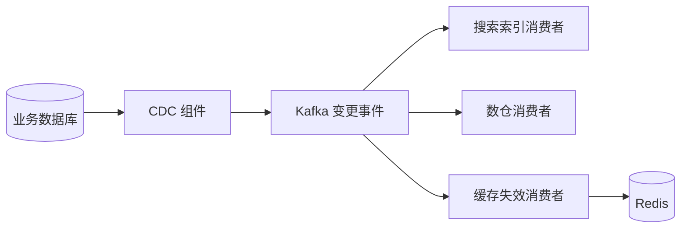
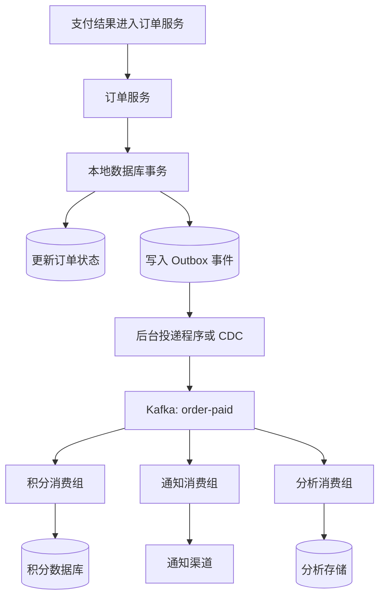

# Kafka 在实际开发中的用途

记录时间：2026-09-22 11:24:48 (Asia/Shanghai)

## 1. Kafka 解决什么问题

Kafka 是分布式事件流平台。在业务开发中，可以把它理解为一套让系统**发布事件、保存事件、独立消费事件**的基础设施。

例如，“订单已支付”是一个已经发生的事实。订单服务发布这个事件后，积分、通知、分析等服务可以分别读取并处理，订单服务不需要逐个调用这些服务。

Kafka 的主要价值包括：

- **异步处理**：把允许稍后完成的工作移出接口的同步等待过程。
- **系统解耦**：生产者发布业务事件，消费者各自决定如何处理。
- **缓冲流量**：下游按自身能力消费，吸收短时间的流量高峰。
- **数据分发**：同一份事件供多个业务系统独立使用。
- **保留与重放**：在数据仍被保留的前提下，重新读取事件，修复结果或重新计算。

Kafka 保存的是事件流。消费成功通常不会立即删除消息，消息生命周期由保留、清理等策略控制。基础概念参考 [Apache Kafka 官方介绍](https://kafka.apache.org/intro/)。

## 2. 理解用途需要掌握的概念

| 概念 | 含义 | 业务示例 |
| --- | --- | --- |
| Producer | 发布消息的应用 | 订单服务 |
| Topic | 按业务组织的事件集合 | `order-paid` |
| Partition | Topic 的分区，用于分布式存储和并行处理 | 根据订单 ID 分配分区 |
| Broker | Kafka 集群中负责存储和服务请求的节点 | Kafka 服务节点 |
| Consumer | 读取并处理消息的应用 | 积分服务 |
| Consumer Group | 协作消费的消费者组 | `points-service` |
| Offset | 消息在某个分区中的位置；消费组据此记录进度 | 分区 0 已处理到哪条消息 |
| Key | 参与分区选择的业务键 | `orderId` |

对通常使用的 Consumer Group 消费方式：

- **不同消费组**独立读取同一个 Topic：积分服务和通知服务可以各自处理同一条支付事件。
- **同一消费组**内的多个实例分担分区：积分服务部署多个实例，协作完成积分计算。
- 一个分区在同一消费组中同时分配给一个消费者。实例数超过分区数时，通常会出现空闲实例。
- 顺序保证的范围是**单个分区**，不能直接理解为整个 Topic 全局有序。

## 3. 实际开发中的典型用途

### 3.1 异步处理：缩短接口等待时间

**场景：用户支付成功后，需要发通知、增加积分和更新统计。**

如果接口同步等待所有附加工作完成，任意下游响应缓慢都会拉长请求耗时。

引入 Kafka 后，支付业务完成自身必须完成的处理，并可靠记录待发布事件；通知、积分、统计随后消费事件。

可观察现象：用户先看到支付成功，积分和通知稍后到达；某个消费者短暂故障后，可以恢复消费。

**边界**：接口返回成功的标准必须明确。例如“支付成功”不代表“通知已送达”。必须立即决定的余额校验、权限校验等，不能只因为接入 Kafka 就随意后移。

### 3.2 系统解耦：减少服务之间的直接依赖

**场景：已有积分和通知服务，现在要新增会员成长值服务。**

新增服务可以用独立消费组订阅已有事件，生产者通常不需要增加一次同步调用。

这种方式降低了运行时耦合，但仍然存在**事件契约耦合**：字段含义、事件触发时机、版本兼容性需要约定。修改 `amount` 的单位等行为，可能同时影响多个消费者。

### 3.3 削峰填谷：保护处理能力有限的下游

**场景：活动期间短时间产生大量订单事件，但报表数据库的写入能力有限。**

Kafka 先接收事件，报表服务以可承受的速度消费和批量写入。

教学示例：假设持续 10 秒，每秒输入 10,000 条、下游处理 2,000 条，忽略其他开销，会积压约 80,000 条。若随后停止输入，按同样速度还需要约 40 秒处理完。

需要注意：

- 削峰意味着部分处理变慢，不等于处理能力凭空增加。
- 长期输入速度大于消费速度，积压会持续增长。
- 需要监控积压量、最旧未处理事件的等待时间、磁盘容量和保留期限。
- 消费者扩容还受分区数、数据库容量、外部接口限流等条件限制。
- Kafka 接收请求不等于订单业务已经成功；异步受理应返回“处理中”等符合实际的状态。

### 3.4 日志、埋点和设备数据采集

**场景：网站产生页面浏览、点击、搜索事件，设备不断上报状态。**

采集服务将事件发送至 Kafka，多个下游分别用于数据存储、实时分析和异常检测。

业务收益是统一数据入口，避免采集端分别对接多个存储或分析系统。Kafka 本身不提供完整的日志检索界面，查询和展示仍需要下游系统。

### 3.5 数据同步与 CDC

**场景：数据库中的商品信息变化后，需要更新搜索索引、缓存或数仓。**

可以使用 CDC（Change Data Capture，变更数据捕获）组件获取数据库变更，再经 Kafka 分发给下游。



这里 Kafka 负责传输和保留事件；读取数据库变更日志、写入目标系统通常由连接器或业务程序完成。

需要处理初始全量同步与增量衔接、删除事件、重复事件、字段变更及目标端版本判断。异步同步存在延迟，不能直接当作跨系统强一致性方案。

### 3.6 实时计算与告警

**场景：按分钟统计成交额，或检测某设备在一段时间内是否持续异常。**

Kafka 提供输入事件流，Kafka Streams、Flink 等处理程序执行聚合、关联或窗口计算，再将结果写入数据库或结果 Topic。

设计时需要明确事件时间、迟到数据、重复数据、窗口边界和结果修正方式。Kafka Broker 不会仅凭存入消息就自动完成业务统计。

### 3.7 历史重放、数据修复与事件追踪

**场景：统计逻辑修复后，希望重新计算过去一天的数据。**

可以通过新的消费组或调整消费位置，重新读取仍被保留的事件。

重放前需要确认：

- 目标时间范围的数据是否仍然存在。
- Topic 是否采用日志压缩（Compaction）；压缩后不保证保留每一次历史变化。
- 重放是否会再次发短信、发券或执行其他外部副作用。
- 历史事件格式能否被当前程序解析。

需要保留完整历史的场景，应专门设计存储与归档策略；普通 Kafka Topic 不能自动等同于永久审计档案。

上述用途与 Kafka 官方列出的消息传递、活动跟踪、日志聚合、流处理及事件存储场景对应；本节业务案例为教学示例，参见 [官方 Use Cases](https://kafka.apache.org/uses/)。

## 4. 完整案例：订单支付后的业务协作



### 4.1 事件设计示例

以下为业务事件载荷示例，Kafka 消息的 Key 可设为 `orderId`：

```json
{
  "eventId": "evt-demo-0001",
  "eventType": "OrderPaid",
  "schemaVersion": 1,
  "occurredAt": "2026-09-22T11:00:00+08:00",
  "orderId": "order-demo-1001",
  "userId": "user-demo-2001",
  "amountMinor": 19900,
  "currency": "CNY"
}
```

`eventId` 用于识别事件和防止重复处理；`schemaVersion` 用于格式演进；金额使用最小货币单位的整数，示例表示 199.00 元。只传递消费者所需的信息，避免把完整用户资料放入事件。

### 4.2 为什么需要 Outbox

直接“先写数据库，再发送 Kafka”存在故障窗口：数据库提交成功，Kafka 发送失败，导致事件缺失。反过来先发送，也可能发生事件已经发布但数据库事务失败。

Outbox 的做法是在**同一个本地数据库事务**中完成业务更新和待发送事件写入，然后由投递程序持续发送、失败重试。这将可靠发布的依据保留在数据库中。

投递程序可能发送成功后尚未更新投递状态就崩溃，因此仍可能重复发布。Outbox 需要与消费者幂等处理配合，并监控未投递事件的积压。

### 4.3 消费者怎样避免重复加积分

可以在积分数据库中，用一个本地事务执行：

1. 写入已处理事件记录，为 `eventId` 建立唯一约束。
2. 如果是首次处理，增加积分。
3. 提交数据库事务后，再提交消费进度。

如果数据库已提交、消费进度尚未提交时程序崩溃，恢复后可能再次收到事件，但唯一约束可以防止重复加分。去重记录与积分变更必须共同提交；仅在处理前写一个独立的“已处理”标记会产生新的失败窗口。

短信等外部调用无法直接参加该数据库事务，需要结合渠道支持的幂等键、投递记录和业务补偿设计。

### 4.4 预期可观察现象

- 暂停通知消费者，积分和分析消费者仍可继续推进各自进度。
- 通知消费者恢复后，在消息仍被保留的前提下继续处理积压事件。
- 重复投递同一个 `eventId`，积分只增加一次。
- 新建分析消费组并配置从保留范围内的起始位置读取，可重新生成统计结果。

这些是架构设计的预期行为，本文没有启动 Kafka 或实际运行该案例。

## 5. 开发中容易踩的坑

| 问题 | 原因或边界 | 应对思路 |
| --- | --- | --- |
| 重复消费 | 重试、消费者重启、处理结果与进度提交之间有故障窗口 | 业务唯一键、唯一约束、幂等更新 |
| 消息缺失 | 发送失败未处理、过早提交进度、保留期不足等 | 检查发送结果；处理成功后提交进度；设计保留策略和补偿 |
| 顺序错乱 | 跨分区、并发处理或重试旁路可能改变业务执行顺序 | 统一 Key 与分区策略；按业务键串行处理；校验版本 |
| 消费积压 | 慢查询、下游限流、热点分区或容量不足 | 定位瓶颈；批处理；评估分区和消费者扩容 |
| 单条坏消息阻塞 | 格式错误或业务无法处理，持续重试 | 分类处理、有限重试、隔离 Topic、告警和人工修复 |
| 历史数据无法重放 | 已过保留期或被压缩 | 根据恢复目标设计保留与归档 |
| 新旧服务不兼容 | 直接删除字段或修改字段含义 | 兼容性规则、契约测试、分阶段演进 |

还需要明确以下可靠性边界：

- `acks=all`、副本配置和 `min.insync.replicas` 需要联合设计；可靠性还取决于故障类型、集群运维和应用错误处理，不能只靠一个参数保证“绝不丢失”。
- Producer 幂等能力主要处理生产者重试引起的重复写入，不能替代消费者的业务幂等。
- Kafka 事务可以协调特定 Kafka 读写流程中的消息与消费进度，不会自动让 MySQL 更新、短信发送等外部操作都“恰好执行一次”。
- 相同 Key 的顺序设计依赖一致的分区策略；增加分区可能改变 Key 的映射，需要评估迁移期间的顺序要求。
- 隔离 Topic、延迟重试和业务补偿需要应用或框架实现，不能假设普通消费者自动具备这些功能。

## 6. Kafka 与 Redis、数据库、HTTP 的分工

| 需求 | 常见选择 | 判断依据 |
| --- | --- | --- |
| 按 ID 查询订单当前状态 | 业务数据库，必要时配合 Redis 缓存 | 需要直接查询当前业务状态 |
| 热点读取、短期计数、缓存 | Redis | 需要快速访问键及相关数据结构 |
| 请求后立即获得处理结果 | HTTP / RPC | 调用方必须等待被调用方答复 |
| 多个系统消费同一业务事件 | Kafka | 需要独立消费进度和事件保留 |
| 高频数据采集、重放和流计算 | Kafka 配合处理与存储系统 | 需要持续处理事件流 |
| 较简单的持久消息流需求 | 可以评估 Redis Streams | 根据规模、保留周期、恢复与运维要求选择 |

Redis Pub/Sub 没有供离线订阅者补读的持久消息历史；Redis Streams 则支持消息存储、消费组和确认机制，不能把两者混为一谈。Kafka 与 Redis Streams 的选择，应基于实际吞吐、数据量、保留时间及团队维护能力。

一个常见组合是：**数据库保存业务状态，Kafka 分发业务变化，Redis 加速读取或承载派生数据。** 例如订单支付后经 Kafka 异步更新统计，再将排行榜结果写入 Redis，供页面快速查询。

本项目已有相关记录：[Redis 的用途与在企业系统架构中的位置](./2026-09-17-001524-Redis用途与架构位置.md)。

## 7. 什么时候值得引入 Kafka

当多个系统需要独立订阅事件、输入流量有明显高峰、需要重放历史数据，或要建设持续的数据采集与计算管道时，Kafka 的价值较明显。

如果只是低频任务、一个简单服务之间的调用，或者所有操作都必须同步获得最终结果，应先评估现有数据库任务表、后台作业或同步接口是否足够。Kafka 会带来集群维护、消息契约、监控告警、幂等和一致性处理等持续成本。

立项前至少回答：允许延迟多久？失败如何恢复？数据保留多久？重复如何处理？是否需要顺序？谁负责积压和投递失败？这些答案比“是否需要一个消息队列”更能决定方案。

## 8. 后续学习入口

- [Kafka 官方介绍](https://kafka.apache.org/intro/)：事件、Topic、Partition 和核心 API。
- [Kafka 官方应用场景](https://kafka.apache.org/uses/)：消息传递、日志、流处理等用途。
- [Kafka 官方文档入口](https://kafka.apache.org/documentation/)：按实际部署版本查阅 Producer、Consumer、事务、配置和运维说明。

本文聚焦用途与设计思路，不依赖某个版本的默认参数，也不包含部署或可执行 Demo。
